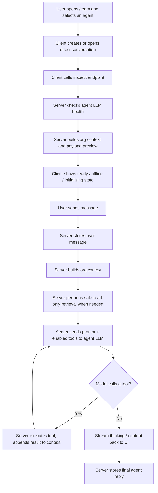
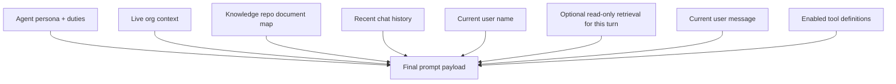
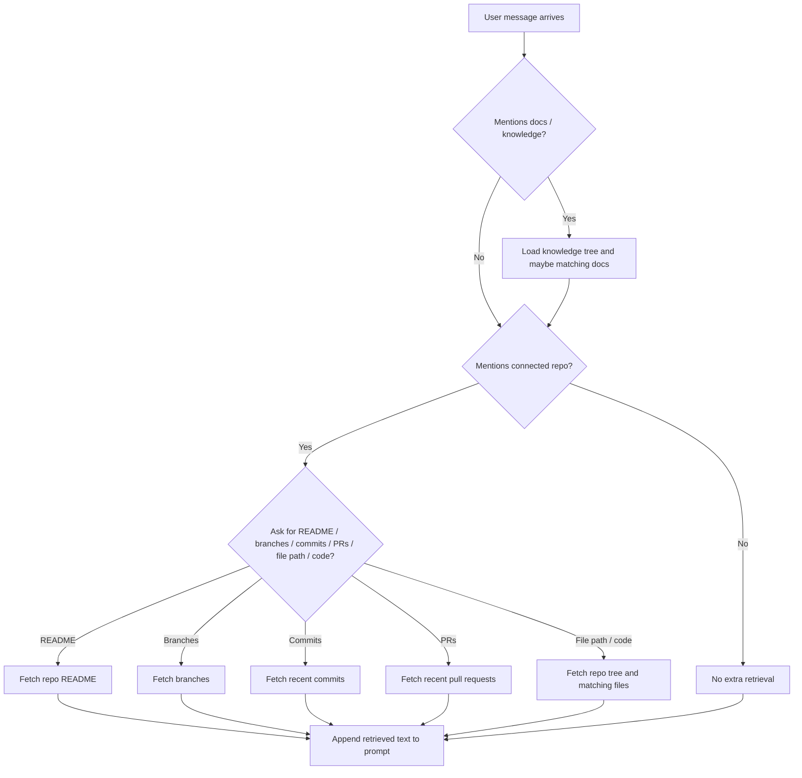
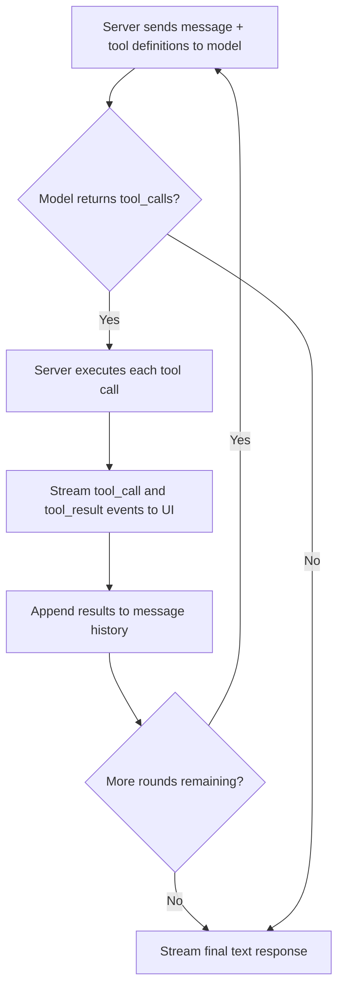
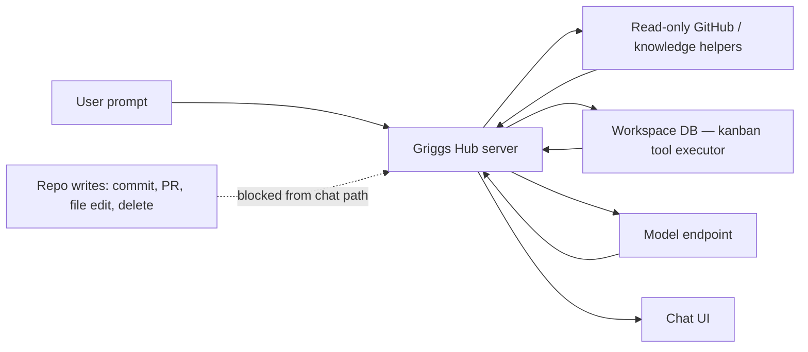

# Team Agent Chat Architecture

This document explains how AI chat on the `/team` page works in Griggs Hub, with a focus on:

- conversation initialization
- agent readiness checks
- live org context injection
- read-only repo and knowledge retrieval
- tool use and workspace actions
- per-agent tool control
- safety boundaries

This is intended for the Griggs Capital Partners knowledge repo.

## Summary

The `/team` agent chat is a server-mediated chat experience.

- The browser never talks directly to GitHub or the model endpoint.
- The server checks whether the selected agent is ready.
- The server builds a context bundle for the turn.
- The server may retrieve extra read-only repo or knowledge artifacts based on the user prompt.
- The server may execute tool calls on behalf of the agent before generating the final reply.
- The server sends the final prompt payload to the configured model endpoint.
- The UI streams progress back to the user, shows what was retrieved, and shows which tools were called.
- Agent responses render as formatted markdown (bold, lists, code blocks, headings, etc.).

## High-Level Flow

## Main Components

### UI

- `/src/components/team/TeamClient.tsx`
  Renders the `/team` chat UI, initialization states, context inspector, streaming state, read-only retrieval badges, real-time tool call activity display, and markdown-rendered agent responses.

### Chat APIs

- `/src/app/api/chat/conversations/route.ts`
  Creates or returns direct/group conversations.
- `/src/app/api/chat/conversations/[id]/messages/route.ts`
  Stores user messages, performs retrieval, runs the tool use loop, calls the model, and returns or streams the agent response.
- `/src/app/api/chat/conversations/[id]/inspect/route.ts`
  Prepares readiness and payload-inspection data for the UI before chatting begins.

### Context Builders

- `/src/lib/agent-context.ts`
  Builds the baseline organization context.
- `/src/lib/agent-retrieval.ts`
  Performs prompt-driven read-only retrieval from connected repos and the knowledge repo.
- `/src/lib/agent-llm.ts`
  Builds the system prompt, runs the tool use loop, and calls the configured model endpoint.

### Tool System

- `/src/lib/agent-tools.ts`
  Defines all available tools in OpenAI function-calling format (`agentChatTools`), human-readable labels (`TOOL_LABELS`), and the server-side executor (`executeAgentTool`).

### Repo / Knowledge Readers

- `/src/lib/github.ts`
  Contains GitHub read helpers used by retrieval.
- `/src/app/api/knowledge/tree/route.ts`
  Returns the knowledge repo document tree.
- `/src/app/api/knowledge/file/route.ts`
  Returns knowledge file contents.
- `/src/app/api/github/commits/route.ts`
  Returns recent commits.
- `/src/app/api/github/pulls/route.ts`
  Returns pull requests.
- `/src/app/api/github/branches/route.ts`
  Returns branch information.
- `/src/app/api/github/readme/route.ts`
  Returns README content.

## Conversation Initialization

When the user clicks an agent:

1. The client opens or creates a direct conversation.
2. The client calls the inspect endpoint.
3. The server probes the configured LLM endpoint.
4. The server builds a preview of the system prompt, org context, and recent history.
5. The UI stays disabled until the agent is confirmed ready.

This prevents the user from typing into a half-initialized chat session.

## Context Layers

The agent does not receive only the user message. It receives a layered prompt payload.

### Baseline Org Context

Baseline org context currently includes:

- team members
- AI agents
- connected repos
- knowledge repo metadata
- knowledge repo document map
- customers
- recent weekly notes
- a plain-language explanation of current repo-access boundaries

### Knowledge Map

The knowledge integration includes the structure of the configured knowledge repo, not just the repo name.

That means the agent can see:

- top-level document groupings
- known markdown paths
- which docs exist before asking for deeper content

This helps the model reason about what documentation is available even if the full document text is not already in the prompt.

## Read-Only Retrieval Layer

The retrieval layer is prompt-driven and server-side.

If a user message mentions a connected repo, a file path, or artifact types like commits, PRs, branches, README, docs, or code, the server may fetch matching material before sending the turn to the model.

### What Can Be Retrieved

- knowledge repo document map
- specific knowledge docs
- connected repo README
- connected repo branches
- recent commits
- recent pull requests
- repo tree / structure summary
- specific source files by path

### What Cannot Be Retrieved Automatically

- arbitrary private repos that are not connected to the workspace
- write-capable repo actions
- destructive GitHub actions
- unrestricted codebase crawling without a bounded match

## Retrieval Decision Flow

## Tool Use

Agents can go beyond answering questions — they can take actions inside the workspace during a chat turn using function calling.

### How It Works

The tool use loop runs before the streaming final response:

1. The server sends the user's message plus the enabled tool definitions to the model.
2. If the model responds with one or more tool calls, the server executes them and appends the results to the message history.
3. This repeats for up to 5 rounds until the model produces a regular text response.
4. The final text response is then streamed to the UI.
5. Tool events (`tool_call`, `tool_result`) are streamed in real-time so the UI can show what is happening.

Both Ollama and OpenAI-compatible endpoints are supported. Tool calling requires a model that supports function calling (e.g. llama3.1, mistral, gpt-4o).

### Available Tools

#### Kanban

| Tool | Label | What it does |
|------|-------|--------------|
| `list_kanban_boards` | Reading kanban boards | Returns all boards, columns, and cards with IDs |
| `create_kanban_card` | Creating card | Creates a new card in any column |
| `update_kanban_card` | Updating card | Edits title, body, priority, labels, assignees, or state |
| `move_kanban_card` | Moving card | Moves a card to a different column |
| `delete_kanban_card` | Deleting card | Permanently deletes a card |

#### Codebase

| Tool | Label | What it does |
|------|-------|--------------|
| `list_repos` | Listing repositories | Returns all connected repos with language, stars, last push |
| `get_repo_details` | Fetching repo details | Returns a repo's full detail including its kanban board and AWS links |

### Tool Use Flow

### UI Display

During tool use, the agent message bubble shows an **"Actions Taken"** block with:

- A spinner while a tool is executing
- A wrench icon when the tool completes
- The human-readable tool label (e.g. "Moving card", "Creating card")

After streaming completes, the action log remains visible on the message so users can see what the agent did.

The streaming status line shows **"Working on it..."** while tool rounds are running, then transitions to **"Streaming reply..."** for the final response.

### Typical Agent Workflows

Examples of what agents can now do in a single chat turn:

- *"Move the login bug card to In Progress"* → calls `list_kanban_boards`, then `move_kanban_card`
- *"Create three cards in Backlog for the auth refactor"* → calls `list_kanban_boards`, then `create_kanban_card` × 3
- *"What repos do we have and which one has the most open issues?"* → calls `list_repos`
- *"Update the OAuth card to high priority and add a 'security' label"* → calls `list_kanban_boards`, then `update_kanban_card`

## Per-Agent Tool Control

Each agent has an independent tool configuration. Tools can be enabled or disabled per-agent on the agent profile page (`/agents/[id]/profile`), in the **Tools & Capabilities** card.

- All tools are **on by default** for every agent.
- Toggling a tool off saves immediately — no save button.
- The card header shows an **"X / Y enabled"** count.
- Tools are grouped by category (Kanban, Codebase).
- Disabled tools are never sent to the model — the model does not know they exist.

### Storage

Disabled tool names are stored as a JSON string array in the `disabledTools` column on the `AIAgent` table. An empty array (`[]`) means all tools are enabled.

When processing a chat turn, the server reads `agent.disabledTools`, filters `agentChatTools` to only the enabled subset, and passes that filtered list to `streamAgentReply`.

## Safety Model

### What Agents Can Do

| Capability | Allowed |
|-----------|---------|
| Read kanban boards, columns, and cards | ✅ |
| Create kanban cards | ✅ |
| Update kanban cards | ✅ |
| Move kanban cards between columns | ✅ |
| Delete kanban cards | ✅ |
| List connected repositories | ✅ |
| Read repo metadata and linked resources | ✅ |
| Read knowledge docs and repo files | ✅ (retrieval layer) |
| Commit, push, or merge code | ❌ |
| Open or close GitHub pull requests | ❌ |
| Edit files in any repository | ❌ |
| Access repos not connected to the workspace | ❌ |

### Important Guarantees

- The browser does not receive GitHub credentials.
- The model does not receive a token that it can use directly.
- Retrieval and tool execution run as server code we control.
- Tool calls are bounded to the tools in `agentChatTools` — arbitrary code execution is not possible.
- Disabling a tool on the agent profile removes it from the model's awareness entirely.
- Kanban write tools (create, update, move, delete) only operate within the workspace database.
- No repo write actions are available from the chat path.

### Architecture Boundary

## UI Transparency

The `/team` chat UI exposes what is happening so users can verify the system:

- initialization state before the chat becomes active
- model readiness and LLM status
- estimated context size
- prompt/system/context inspection via the context inspector
- read-only retrieval source badges on replies
- real-time tool call activity with status (running → done) on agent messages
- formatted markdown responses (bold, lists, code blocks, headings) instead of raw syntax

## Response Formatting

Agent responses render as markdown inside the chat bubble. Supported formatting:

- **Bold** and *italic* text
- Bullet and numbered lists
- Headings (rendered compactly for chat)
- Inline code and fenced code blocks with language labels
- Blockquotes
- Links
- Horizontal rules

This means agents can return structured answers with clear sections, steps, and code examples without the user seeing raw asterisks or markdown syntax.

## Current Limitations

- Tool use requires a model that supports function calling. Models that do not support it will fall through to the standard streaming path (no tools called).
- Retrieval is based on message cues, repo names, artifact keywords, and file-path matches. Vague prompts may not trigger the right retrieval.
- Retrieved content is truncated to keep prompts bounded.
- Source-file retrieval is strongest when the prompt includes a repo name and/or an exact file path.
- The tool use loop runs a maximum of 5 rounds to prevent runaway execution.

## Recommended Next Improvements

- Persistent agent memory that survives context clears (summarized facts written back to the agent record)
- Proactive / scheduled agents that initiate conversations on a timer or event
- Multi-agent handoff routing (orchestrator agent delegates to specialists)
- File and image attachment support in chat input
- Tool call audit log per conversation (permanent record of what each agent did)
- Smarter repo inference from feature names and domain terms
- Commit and PR diff summarization
- Retrieval ranking and limits tuning
- Additional tool categories: customer notes, sprint management, weekly note entries

## Example User Prompts

These are the kinds of prompts the current system handles well:

**Kanban actions:**
- "Move the auth bug card to In Progress."
- "Create a card called 'Fix login timeout' in Backlog with high priority."
- "Update the OAuth card — set priority to critical and add a 'security' label."
- "What cards are currently In Progress?"

**Code / repo awareness:**
- "What repos do we have connected?"
- "What changed recently in `griggs-capital-partners/portal`?"
- "Show me the latest PR activity in `hub`."
- "Read `src/components/team/TeamClient.tsx` in `hub` and explain the chat bootstrap."
- "What docs do we have about Oracle tasks in the knowledge repo?"

**Knowledge retrieval:**
- "Summarize the README and recent commits for `mqtt_portal`."
- "What do our docs say about the weekly notes workflow?"

## Key Design Principles

The team chat agent should be:

- **Context-aware** — knows the org, the board, the repos, and the docs
- **Action-capable** — can take real workspace actions, not just answer questions
- **Inspectable** — users can see what was retrieved, what tools ran, and what the agent knew
- **Controllable** — each agent's tool access can be tuned per-agent
- **Safe by default** — repo writes remain blocked; kanban writes are bounded to the workspace DB
